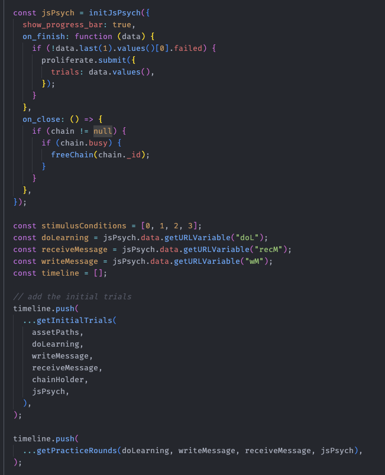

---
# You can also start simply with 'default'
theme: seriph
# random image from a curated Unsplash collection by Anthony
# like them? see https://unsplash.com/collections/94734566/slidev
background: https://cover.sli.dev
# some information about your slides (markdown enabled)
title: Welcome to Slidev
info: |
  ## Slidev Starter Template
  Presentation slides for developers.

  Learn more at [Sli.dev](https://sli.dev)
# apply unocss classes to the current slide
class: text-center
# https://sli.dev/features/drawing
drawings:
  persist: false
# enable MDC Syntax: https://sli.dev/features/mdc
mdc: true
# open graph
# seoMeta:
#  ogImage: https://cover.sli.dev
---

# Running experiments online

Ben Prystawski - July 7, 2025

---

# Psychology research, oversimplified

<v-click>
<Arrow x1="550" x2="520" y1="350" y2="250"/>
<Arrow x1="600" x2="650" y1="350" y2="250"/>

  We'll cover these two (mostly the first one)

</v-click>

---

# The plan

1. Overview of running online experiments
2. Prolific
3. Implementing experiments in Qualtrics / JsPsych
4. Data import in R, Python

<!--
Here is another comment.
-->

---

# Online experiments

Equal parts amazing and infuriating

<v-clicks depth="2">

- Online experiments are fast and conveneint!
  - I've gathered ~400 people worth of data in a single day
- They're (maybe) more representative than university students
- But you need to take some extra steps to ensure data quality
- Some paradigms (e.g. eye-tracking, brain stuff) don't work online

</v-clicks>

---
layout: image-right
image: https://matrix.berkeley.edu/wp-content/uploads/2021/09/mechanical_turk.jpeg
---

# Recruiting people

So where do you get people to do your study?

We recruit people on *crowd-working platforms*.

<v-clicks depth="2">

The two big ones are Amazon Mechanical Turk and Prolific.

Prolific is the most popular among psychologists these days

</v-clicks>

---

<v-clicks>

Anyone can sign up and complete surveys for pay. 

Anyone can pay people to do surveys on Prolific.

You can post a study and choose who it gets shown to based on location, demographics, etc.

Let's take a look at the interface!

</v-clicks>

---
level: 2
---

# Ben's Prolific tips and tricks

<v-clicks>

- Performance-dependent bonus payments can be useful to motivate participants (you can pay them in bulk too!)
- Checking "microphone required" can help to deter bots (even if your study doesn't actually require a microphone)
- Filter participants based on number of completions and approval rate (>=98%)
- Don't reject people. Request return if they didn't complete the task.

</v-clicks>

---

# The experiment part

So how do you actually make an experiment to send people to?

<v-clicks>

There are plenty of options, but we're going to cover two:

- Qualtrics
- JsPsych

</v-clicks>

---
class: px-20
---

# Qualtrics

<v-clicks>

- Qualtrics is a popular platform for making surveys
- It uses a simple drag-and-drop interface 
- There's a lot of more advanced functionality available (e.g writing arbitrary javascript)

</v-clicks>

---

# Qualtrics tutorial

Do people prefer cats or dogs? Let's make a quick survey to find out!

You can follow along at <a href="https://stanforduniversity.qualtrics.com/">https://stanforduniversity.qualtrics.com/</a>

---

<v-clicks>

- a framework for making experiments using javascript
- free and open source
- makes it easier to use version control, share your experiment with others, etc.
- if you know some programming, i would recommend using jspsych for simple experiments.

</v-clicks>

---

# Considerations when using JsPsych

Where will I host my experiment?

<v-clicks>

- JsPsych experiments are *static*, meaning they contain only HTML, CSS, and JavaScript that runs in the participant's browser.
- Lots of websites let you host static files for free. GitHub Pages is a simple option.

</v-clicks>

Where will I save my data?

<v-clicks>

- Because the experiment is static, you need to set up somewhere for the data to go.
- There are a few services that let you save data, including cognition.run and proliferate.
- If your lab runs JsPsych experiments, ask your labmates what they use!

</v-clicks>

---

# Tips for making good experiments

<v-clicks>

- People like progress bars and they're easy to implement in Qualtrics and JsPsych
- Comprehension and/or attention checks are often a good idea
- Think about accessibility: if color is important to your task, see if you can use a colorblind-friendly palette.
- Get your labmates / friends to test your experiment before posting it.

</v-clicks>

---

# Getting the data

If you ran your study on Qualtrics, you can download it as a csv.

---

# You can load the data easily with QualtRics

There's also a Python package called QualtricsAPI.

---

# JsPsych – solutions vary

You can usually click a button to download the data as a csv. Then you can into Python/R.

---

# Questions?

